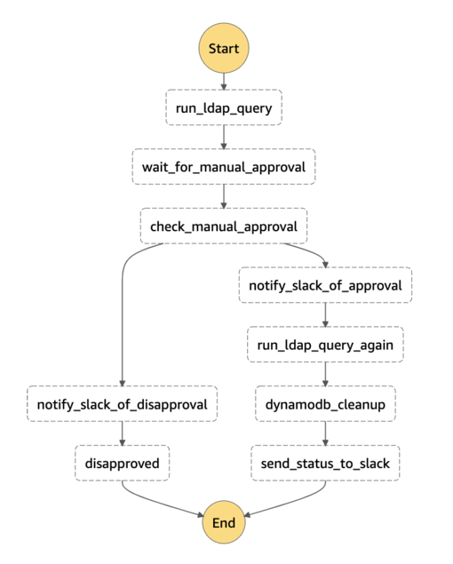

<<<<<<< HEAD
# terraform-aws-ldap-maintainer

A step function to maintain LDAP users via slack.
=======
# terraform-aws-ldap-maintenance

A step function to maintain LDAP users via slack.

## Overview

This project deploys a collection of lambda functions, an api endpoint, and a step function that will automate disabling LDAP users via an interactive slack message.

## Setup

1. Retrieve the LDAPS endpoint of your target AD deployment.

    **Note:** This can be accomplished via SimpleAD by creating an ALB that listens via TLS on port 636 and forwards requests to your SimpleAD A record. See the associated [AWS blog post](https://aws.amazon.com/blogs/security/how-to-configure-an-ldaps-endpoint-for-simple-ad/) or the tests of this project for a reference architecture.

2. Within your LDAP directory create a user that will be used by the lambda function. This user will need permissions to query LDAP and disable users.
3. Populate an *encrypted* ssm parameter with this new user's password and use the key value as the input for `svc_user_pwd_ssm_key` variable.
4. Generate the lambda layers for this project by running `bin/generate-layers.sh` use the `-r` option to generate the layers via docker or `-c` to create them locally.
5. Configure your `terraform.tfvars` with the required inputs.
6. Run `terraform init/apply`
7. Using the provided output url, enable slack events for your slackbot
      1. Go to https://api.slack.com
      2. Find your app
      3. Navigate to Features > Event Subscriptions > Enable Events
      4. Enter the api gateway url created in the previous step
8. Test the integration by manually triggering the LDAP maintenance step function with the following payload: `{"action": "query" }`

## Submodules

[API Gateway](/modules/api_gateway)

### Lambda Functions

- [DynamoDB Cleanup](/modules/lambda_functions/dynamodb_cleanup): Facilitates removing disabled users' email(s) from a target dynamoDB table
- [LDAP Query](/modules/lambda_functions/ldap_query): Used to perform actions against a target ldap database
- [Slack Listener](/modules/lambda_functions/slack_listener): Responds to slack events from a SQS queue
- [Slack Notifier](/modules/lambda_functions/slack_notifier): Sends status updates to slack and a target step function

## Architecture

## References

- The [AD Schema](https://docs.microsoft.com/en-us/windows/win32/adschema/active-directory-schema)
- Bobbie Couhbor's awesome [blogpost](https://blog.kloud.com.au/2018/01/09/replacing-the-service-desk-with-bots-using-amazon-lex-and-amazon-connect-part-3/) on using python-ldap via lambda
- Rigel Di Scala's blog post [Write a serverless Slack chat bot using AWS](https://chatbotslife.com/write-a-serverless-slack-chat-bot-using-aws-e2d2432c380e)

## Inputs

| Name | Description | Type | Default | Required |
|------|-------------|:----:|:-----:|:-----:|
| create\_dynamodb\_cleanup | Controls wether to create the dynamodb cleanup resources | bool | `"true"` | no |
| domain\_base\_dn | Distinguished name of the domain | string | n/a | yes |
| dynamodb\_table\_arn | ARN of the dynamodb to take actions against | string | n/a | yes |
| dynamodb\_table\_name | Name of the dynamodb to take actions against | string | n/a | yes |
| filter\_prefixes | (Optional) List of three letter user name prefixes to filter out of the user search results | list(string) | `<list>` | no |
| ldaps\_url | LDAPS URL of the target domain | string | n/a | yes |
| log\_level | (Optional) Log level of the lambda output, one of: Debug, Info, Warning, Error, or Critical | string | `"Info"` | no |
| maintenance\_schedule | Periodicity at which to trigger the ldap maintenance step function | string | `"cron(0 8 1 * ? *)"` | no |
| project\_name | Name of the project | string | `"ldap-maintainer"` | no |
| slack\_api\_token | API token used by the slack client | string | n/a | yes |
| slack\_channel\_id | Channel that the slack notifier will post to | string | n/a | yes |
| slack\_signing\_secret | The slack application's signing secret | string | n/a | yes |
| svc\_user\_dn | Distinguished name of the LDAP Maintenance service account used to manage simpleAD | string | n/a | yes |
| svc\_user\_pwd\_ssm\_key | SSM parameter key that contains the LDAP Maintenance service account password | string | n/a | yes |
| tags | Map of tags to assign to this module's resources | map(string) | `<map>` | no |
| vpc\_id | ID of the VPC hosting the target Simple AD instance | string | n/a | yes |

## Outputs

| Name | Description |
|------|-------------|
| slack\_listener\_endpoint | API endpoint to use as the slack application's Interactive Components request URL |

>>>>>>> 2fab932... Module initialization
